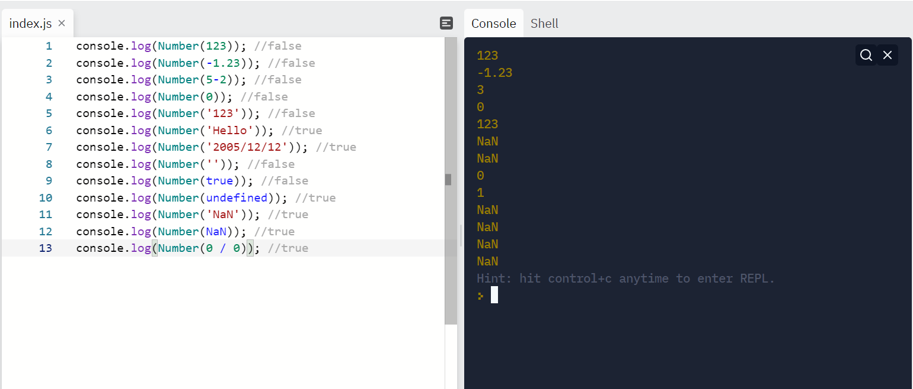
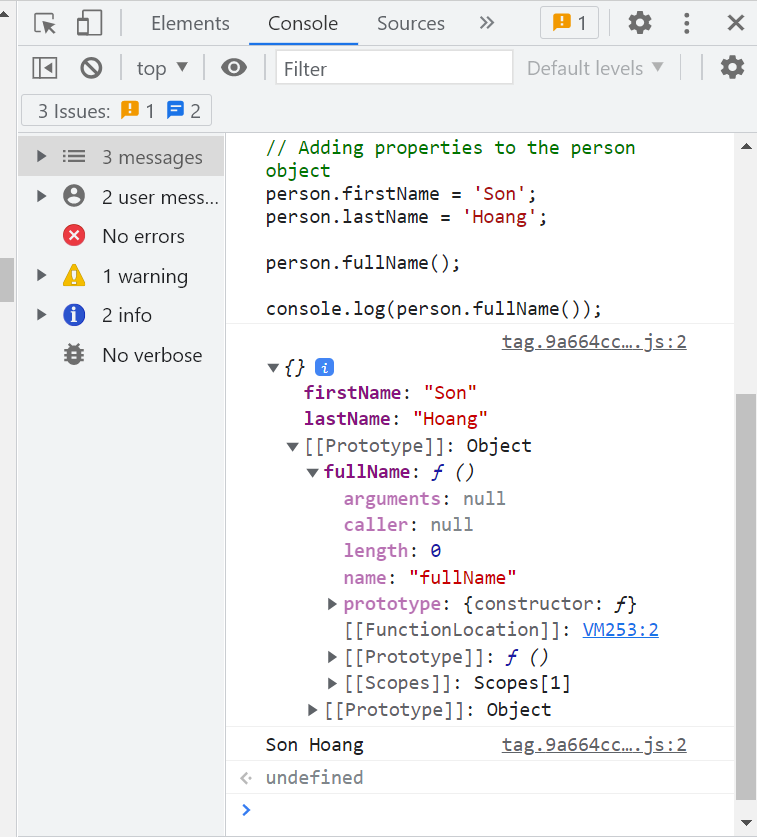
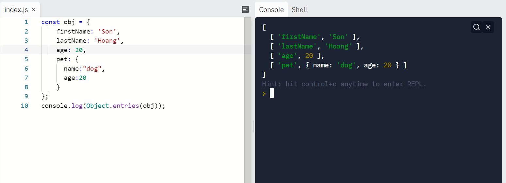
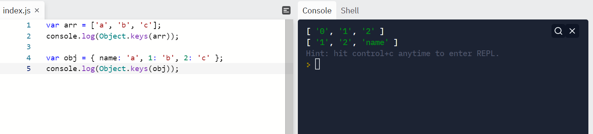
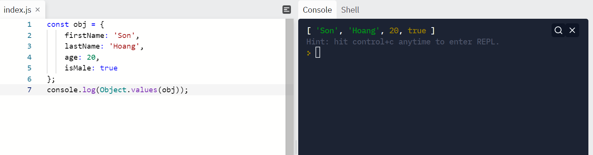
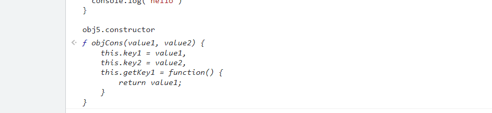

# Báo cáo thực tập isofh buổi 2 ngày 18/01/2022

## A. Các công việc đã thực hiện

1. Responsive learn page của IVIRSE với màn hình IP 11 pro.
2. Thực hiện fix lại trang documentation chị Kim Anh giao.
3. Đọc các tài liệu anh Nam gửi:

## B. Nội dung thu được từ tài liệu anh Nam gửi

### I. Các IDE trong VScode: (Đã cài)

- các extension hỗ trợ, highlight và format
- Enable emmet để có các gợi ý snippet sử dụng trong JSX.
- Cách custom snippet CSS để tái sử dụng nhanh gọn hơn chỉ bằng cú pháp.

### II. CHROME EXTENSION: (Đã cài)

- VisBug: Công cụ hỗ trợ việc code frontend với các chức năng xem kích thước, inspect, di chuyển các element, điều chỉnh các thuộc tính của element, tìm kiếm element...
- Redux DevTool: Extension hỗ trợ việc code redux, giúp ta có thể xem được các state,action của component thay đổi ra sao. Có chức năng hỗ trợ việc xem lại quá trình thay đổi các action và state đó.
- React developer tool: Extension hỗ trợ việc inspect trang web dưới dạng các Component đươc thiết kế trong code và có thể view được các props, state được truyền vào, thay đổi ra sao...

### III. Javascript

#### 1. Các hàm xử lý cơ bản

- Các hằng mặc định:

hằng | địnhn ghĩa
-----|-----------
Infinity | số vô cực
NaN| mang giá trị ko phải là số, nhưng không đại diện cho các giá trị khác kiểu số
undefined| đại diện cho biến chưa được khai báo giá trị

- Các hàm:

**a) encodeURI và encodeURIComponent**

hàm | định nghĩa
----|-----------
encodeURI()| mã hóa URI
decodeURI()| giải mã URI đã được mã hóa bởi encodeURI
encodeURIComponent()| mã hóa một URI trở thành một phần của URI khác
decodeURIComponent()|giải mã một phần URI khác

Phân việt sự khác nhau giữa `encodeURI()` và `decodeURI()`.

- Đối với `encodeURI()` thì các kí tự đặc biệt sẽ được mã hóa ngoại trừ các kí tự: `~!@#$&*()=:/,;?+`
- Đối với `encodeURIComponent()` thì các kí tự đặc biệt sẽ được mã hóa ngoại trừ các kí tự: `-_.!~*'()`

Vì vậy `encodeURI()` sẽ thường được sử dụng với một URI đơn lẻ mà có bao gồm các kí tự đặc biệt không nằm trong quy chuẩn của URI. ví dụ:

```Javascript
var uri = "my test.asp?name=ståle&car=saab";
var res = encodeURI(uri);
console.log(res);
 //Kết quả: "my%20test.asp?name=st%C3%A5le&car=saab"
```

URI trên có bao gồm các kí tự đặc biệt cần được mã hóa như khoảng trắng và kí tự `å`, ngoài ra các kí tự khác đạt quy chuẩn thì sẽ không bị mã hóa.

`encodeURIComponent()` thì được dùng trong trường hợp muốn nối URI này vào URI khác nhằm mục đích mã hóa cả các kí tự như dấu `?` hay đoạn `http://`...

```Javascript
// Cần mã hóa:
var url = "https://phambinh.net?page=10";
var endpoint = "https://domain.com?url=" + encodeURIComponent(url);
 
console.log(endpoint);
//Kết quả: "https://domain.com?url=https%3A%2F%2Fphambinh.net%3Fpage%3D10"

```

**b) eval():**

- dùng để chạy code JS dưới dạng string

```Javascript
var a = 4.5;
var b = 5.8;

var c = eval("a+b");
var d = '1+2/3';
console.log(typeof c);
console.log(c);
// Kết quả: 10.3 | number
console.log(typeof d);
console.log(d);
// Kết quả: 1+2/3 | string
```

**c) isFinite():**

- Hàm trả về giá trị boolean kiểm tra xem một giá trị có phải là số hữu hạn hay không. Đúng trả về true và ngược lại.

Như vậy tất cả các giá trị không phải số hoặc giá trị số là vô cực thì sẽ làm hàm trả về false.

```Javascript
isFinite(123); // true
isFinite(-1.23); // true
isFinite(5-2); // true
isFinite(0); // true
isFinite("123"); // true
isFinite("Hello"); // false
isFinite("2005/12/12"); // false
isFinite(+Infinity); // false
isFinite(-Infinity); // false
isFinite(NaN); // false
isFinite(eval("2005/12/12"));
```

**d) isNaN():**

Hàm kiểm tra xem một giá trị có phải `Not a Number` hay không. Trước khi thực hiện kiểm tra, hàm này convert giá trị cần kiểm tra sang số trước khi kiểm tra. Vì vậy ta có 1 số ví dụ nếu kiểm tra `isNaN()` cho các giá trị:



Từ các ví dụ trên ta rút ra được hàm `Number` chính là hàm ép các giá trị về kiểu số. Nếu không ép được thì sẽ trả về `NaN`.

**e) parseFloat():**

- Được sử dụng khi muốn chuyển thành số dấu phẩy động. Hàm sẽ chỉ chuyển được nếu chuỗi bắt đầu bằng số (không tính khoảng trắng và tab) và lấy ra số đầu tiên trong chuỗi trước khi gặp kí tự khác khác kiểu số. Nếu không thỏa mã các điều kiện như trên thì sẽ trả về `NaN`

```Javascript
parseFloat("10"); // 10
parseFloat("10.00"); // 10
parseFloat("10.33"); // 10.33
parseFloat("34 45 66"); // 34
parseFloat(" 60 "); // 60
parseFloat("40 years"); // 40
parseFloat("He was 40"); // NaN
```

**f) parseInt():**

- Hàm thực hiện việc chuyển đổi một chuỗi về số nguyên. Hàm sẽ chỉ chuyển được nếu chuỗi được bắt đầu bằng số (không tính các dấu khoảng cách như space, tab) và lấy ra số đầu tiên. Nếu không sẽ trả về NaN.

**Syntax:**

```Javascript
parseInt(string, radix)
```

Trong đó:
- `string`: bắt buộc, là chuỗi cần ép về dạng số nguyên.
- `radix`: không bắt buộc (một số từ 2 – 36) đại diện cho cơ số được sử dụng.

Nếu hàm `parseInt()` để trống tham số `radix`, thì cơ số sẽ được xác định dựa vào string như sau:

- Nếu string bắt đầu với “0x” thì sẽ là cơ số 16.
- Nếu string bắt đầu với bất kỳ số nào sẽ là cơ số 10.
- Với một số trình duyệt cũ sử dụng phiên bản JavaScript cũ (cũ hơn ES5) thì string bắt đầu với “0” sẽ được coi là cơ số 8. Tuy nhiên các trình duyệt đó giờ không còn được dùng nữa.

```Javascript
parseInt("10"); // 10
parseInt("10.00"); // 10
parseInt("10.33"); // 10
parseInt("34 45 66"); // 34
parseInt(" 60 "); // 60
parseInt("40 years"); // 40
parseInt("He was 40"); // NaN
parseInt("10", 10); // 10
parseInt("010"); // 10
parseInt("10", 8); // 8
parseInt("0x10"); // 16
parseInt("10", 16); // 16
```

**g) String():**

Ép kiểu bất kì giá trị gì về kiểu `string`

```Javascript
let x1 = Boolean(0);
let x2 = Boolean(1);
let x3 = new Date();
let x4 = "12345";
let x5 = 12345;
 
console.log(String(x1)); // 'false'
console.log(String(x2)); // 'true'
console.log(String(x3)); // 'Sat Feb 01 2020 02:36:44 GMT+0000 (Coordinated Universal Time)'
console.log(String(x4)); // '12345'
console.log(String(x5)); // '12345'
```

#### 2. Object

Một Object có dạng

```Javascript
{
   key1: value1,
   key2: value2,
   ...
}
```

**Ví dụ:**

```Javascript
let a = {
    name: "Sơn",
    age: 20,
    isMale: true,
    pet: {
        type:"Chó",
        age:10
    }
}

// Truy xuất dữ liệu
console.log(a.name)// Sơn
console.log(a["name"])//Sơn
var b = 'age'
console.log(a[b])//20
console.log(a.pet.type)//Chó
```

**Một số phương thức với Object:**

**a) Object.assign()**

- Dùng để sao chép các giá trị của tất cả các thuộc tính của 1 hoặc nhiều object vào object khác.

Việc thay giá trị của các thuộc tính của object mới sẽ không ảnh hưởng tới object được sao chép.

```Javascript
const sourceObject = {
    firstName: 'Son',
    lastName: 'Hoang'
};
const targetObject = Object.assign({}, sourceObject);

console.log(targetObject);
// { firstName: 'Son', lastName: 'Hoang' }
targetObject.firstName = "Ok";
console.log(sourceObject)//// { firstName: 'Son', lastName: 'Hoang' }
console.log(targetObject)// { firstName: 'Ok', lastName: 'Hoang' }
```

Các thuộc tính của đối tượng đích sẽ được viết đè với các thuộc tính của đối tượng đích nếu chúng có key giống nhau.

```Javascript
const sourceObject = {
    firstName: 'Son',
    lastName: 'Hoang'
};
const targetObject = Object.assign({ lastName: 'Tran' }, sourceObject);

console.log(targetObject); // { firstName: 'Son', lastName: 'Tran' }
```

Sao chép nhiều Object vào một object

```Javascript
const obj1 = {
    firstName: 'Son',
    lastName: 'Hoang'
};
const obj2 = { age: 20 };
const obj3 = { school: 'HUST' };

const obj = Object.assign({}, obj1, obj2, obj3);

console.log(obj); // { firstName: 'Son', lastName: 'Hoang', age: 23, school: 'HUST' }
```

**b) Object.create():**

Tạo một Object mới kế thừa các prototype của object hiện có:

**Syntax:**

```Javascript
Object.create(prototypeObject, propertiesObject)
```

Trong đó:

- prototypeObject: Object prototype mới được tạo. Nó có thể là object hoặc null.
- propertiesObject: Các thuộc tính của object mới (tùy chọn).

**Ví dụ:**

```Javascript
var person = Object.create(null);

typeof(person) // Object
console.log(person) // {}

// Set property to person object
person.name = 'Son Hoang';

console.log(person) // { name: 'Son Hoang' }
```

Có prototype

```Javascript
prototypeObject = {
    fullName: function(){
        return this.firstName + ' ' + this.lastName;
    }
};
var person = Object.create(prototypeObject);

console.log(person); // {}

// Adding properties to the person object
person.firstName = 'Son';
person.lastName = 'Hoang';

person.fullName();

console.log(person.fullName()); // Son Hoang
```

Để thấy rõ hơn:



**c) Object.entries():**

Hàm trả về mảng các cặp giá trị `[key,values]` đếm được của Object.

**Syntax:**

```Javascript
Object.entries(obj)
```

**Ví dụ:**

```Javascript
const obj = {
    firstName: 'Son',
    lastName: 'Hoang',
    age: 20,
    pet: {
      name:"dog",
      age:20
    }
};

```



**d) Object.keys():**

Trả về một mảng các tên thuộc tính đếm được của một object đã cho.

**Syntax:**

```Javascript
Object.keys(obj)
```

**Ví dụ:**

```Javascript
var arr = ['a', 'b', 'c'];
console.log(Object.keys(arr));

var obj = { name: 'a', 1: 'b', 2: 'c' };
console.log(Object.keys(obj));
```



**e) Object.values():**

Trả về một mảng các giá trị của những thuộc tính đếm được trong object đã cho.

**Syntax:**

```Javascript
Object.values(obj)
```

**Ví dụ:**

```Javascript
const obj = {
    firstName: 'Son',
    lastName: 'Hoang',
    age: 20,
    isMale: true
};
console.log(Object.values(obj));
```



**f) Object.prototype:**

Các cách khởi tạo một object

```Javascript
const obj1 = {};
const obj2 = new Object();
const obj3 = Object.create({})

// function constructor

function objCons(value1, value2) {
    this.key1 = value1,
    this.key2 = value2,
    this.getKey1 = function() {
        return value1;
    }
}

const obj5 = new objCons(valueIn1, valueIn2);
```

Khi khởi tạo các Object bằng cùng một function constructor thì việc thêm thuộc tính hay sửa đổi các giá trị của các Object đó đều không có liên quan đến nhau. Tức là :

```Javascript
const obj5 = new objCons(1,3);
const obj6 = new objCons(2,4);

obj5.newKey = 9//
console.log(obj5.newKey)//9
console.log(obj6.newKey)//undefined
```

Để các Object tạo bằng cùng một function constructor đều thừa hưởng một thuộc tính mới được tạo bên ngoài function constructor thì ta dùng `Object.prototype`.

```Javascript
const obj5 = new objCons(1,3);
const obj6 = new objCons(2,4);

objCons.prototype.newKey = 9//
console.log(obj5.newKey)//9
console.log(obj6.newKey)//9

objCons.prototype.hello = function() {
    console.log('hello');
}

console.log(obj5.hello())//hello
console.log(obj6.hello())//hello
```

**g) Object.prototype.constructor:**

Hàm trả về function constructor của Object, không bao gồm các prototype được tạo sau này.

```Javascript
console.log(obj5.constructor)
```



**h) Object.prototype.hasOwnProperty:**

Trả về giá trị boolean cho biết object có thuộc tính được đưa ra không

**Syntax:**

```Javascript
obj.hasOwnProperty(prop)
```

**Ví dụ:**

```Javascript
obj = new Object();
obj.prop = 'exists';
console.log(obj.hasOwnProperty('prop')); // true
console.log(obj.hasOwnProperty('toString')); // false
console.log(obj.hasOwnProperty('hasOwnProperty')); // false
```

**i) Object.prototype.valueOf:**

Hàm set giá trị trả về cho một Object

```Javascript
function MyAge(age) {
    this.age = age;
};

MyAge.prototype.valueOf  = function () {
    return this.age;
};

const myAge = new MyAge(23);
console.log('My age is', myAge - 1); // My age is 22
```

**Note:** Object là kiểu dữ liệu tham chiếu, tức là không thể so sánh hai Object kể cả khi mọi thuộc tính của chúng đều có giá trị giống nhau bởi vì tham chiếu của chúng luôn giống nhau. Chính vì vậy ta không nên tạo một object mới bằng cách gán nó bằng một Object đã được khởi tạo vì nó sẽ được gán tham chiếu của Object kia dẫn đến việc một trong hai Object thay đổi thì Object còn lại sẽ thay đổi theo.

**Ví dụ 1:**

```Javascript
// Two variables, two distinct objects with the same properties
var fruit = {name: 'apple'};
var fruitbear = {name: 'apple'};

fruit == fruitbear; // return false
fruit === fruitbear; // return false
```

**Ví dụ 2:**

```Javascript
// Two variables, a single object
var fruit = {name: 'apple'};
var fruitbear = fruit;  // assign fruit object reference to fruitbear

// here fruit and fruitbear are pointing to same object
fruit == fruitbear; // return true
fruit === fruitbear; // return true

fruit.name = 'grape';
console.log(fruitbear);    // yields { name: "grape" } instead of { name: "apple" }
```