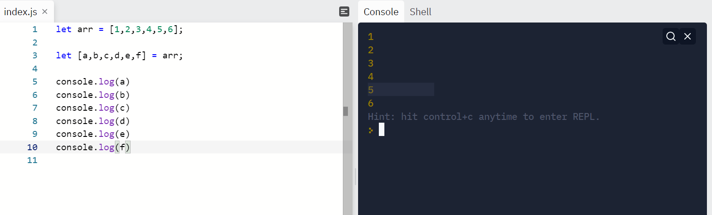
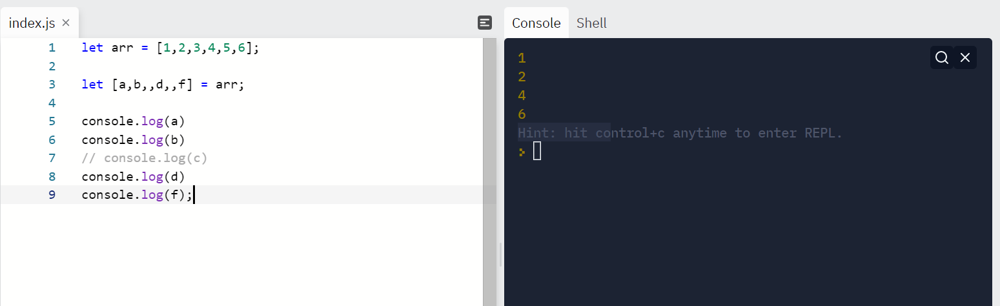
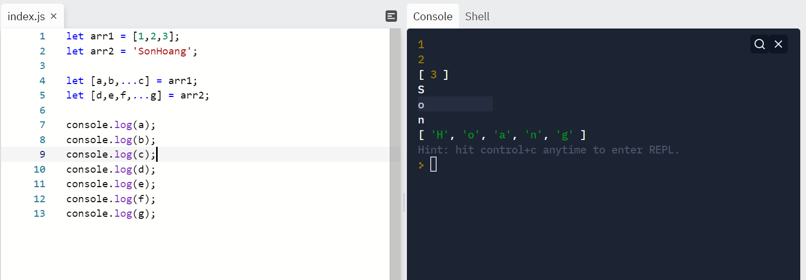
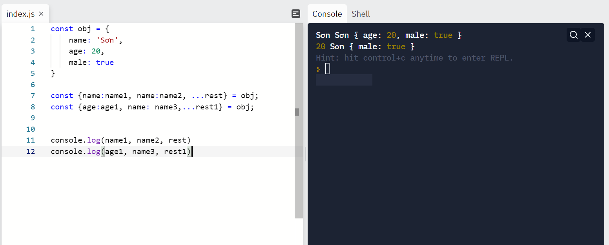
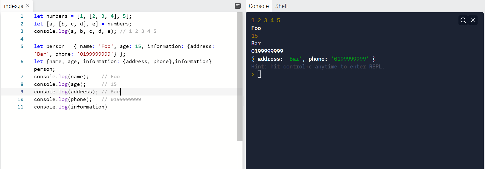
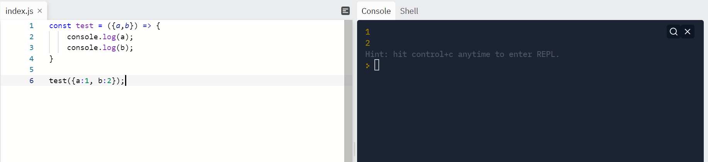
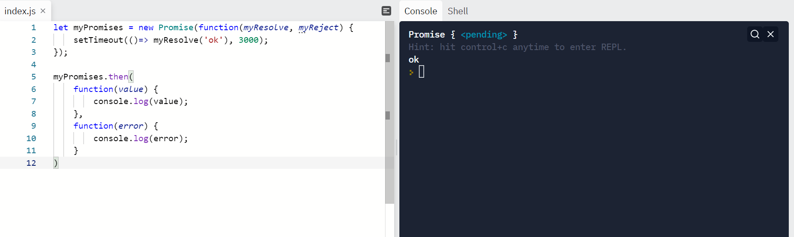
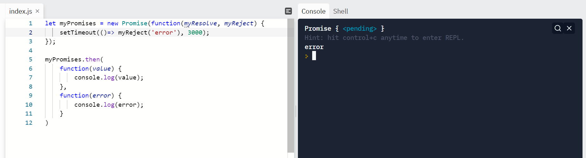

# Báo cáo thực tập ISOFH ngày 19/01/2022

## A. Các công việc đã thực hiện

1. Responsive giúp bạn Đức các page
2. Đọc tài liệu.

## B. Các kiến thức thu được từ tài liệu

### I. Các hàm xử lý của ARRAY trong JS

Ấn vào tên các hàm để xem `Syntax` và `ví dụ`.

Hàm | Chức năng
----|----------
[Array.concat()](./array_method/concat.js)| Hàm dùng để nối các mảng với nhau
[Array.copyWithin()](./array_method/copyWithin.js)|Hàm dùng để copy một đoạn trong mảng và ghi đè vào từ vị trí nào đó trong mảng
[Array.entries()](./array_method/entries.js)| Hàm trả về một Array từ mảng ban đầu, các phần tử của Array trả về là các mảng cặp `[key,value]`, đối với mảng thì key chính là index và value là giá trị các phần tử mảng
[Array.every()](./array_method/every.js)| Hàm dùng để kiểm tra xem tất cả các phần tử mảng có thỏa mãn một điều kiện nào đó không. Hàm trả về `true` khi tất cả các phần tử mảng đều thỏa mãn điều kiện và trả về `false` khi có ít nhất một phần tử không thỏa mãn.
[Array.fill()](./array_method/fill.js)| Hàm dùng để biến đổi các phần tử mảng mà mình muốn trở thành các giá trị giống nhau
[Array.filter()](./array_method/filter.js)|Hàm trả về mảng các phần tử trong mảng thỏa mãn một điều kiện nào đó mà không làm thay đổi mảng ban đầu.
[Array.find()](./array_method/find.js)| Hàm dùng để tìm ra phần tử mảng đầu tiên thỏa mãn một điều kiện nào đó
[Array.findIndex()](./array_method/findIndex.js)| Hàm dùng để tìm vị trí của phần tử đầu tiên trong mảng thỏa mãn điều kiện nào đó, nếu không có phần tử nào thỏa mãn sẽ trả về `-1`
[Array.forEach()](./array_method/forEach.js)| Hàm dùng để duyệt qua tất cả các phần tử mảng
[Array.from()](./array_method/from.js)| Sử dụng khi muốn tạo ra một mảng mới từ đối tượng dạng mảng.
[Array.includes()](./array_method/includes.js)|Hàm sử dụng để kiểm tra xem mảng có chứa phần tử này hay không, trả về `true` khi có và ngược lại
[Array.indexOf()](./array_method/indexOf.js)|Hàm dùng để tìm ra index đầu tiên của một phần tử trong mảng.( Hàm này khá giống findIndex nhưng khác ở chỗ một hàm tìm theo điều kiện, còn hàm này thì giống như là includes nhưng là trả về index của phần tử đầu tiên cần tìm index trong mảng). Hàm sẽ trả về `-1` nếu không tìm thấy phần tử cần tìm.
[Array.isArray()](./array_method/isArray.js)| Hàm này dùng để kiểm tra xem một đối tượng nào đó có phải là array hay không. Hàm trả về `true` khi đó là mảng và ngược lại
[Array.join()](./array_method/join.js)|Hàm dùng để nối các phần tử trong mảng thay một chuỗi mà không làm thay đổi mảng ban đầu.
[Array.keys()](./array_method/keys.js)|Hàm trả về một đối tượng Array Iterator với giá trị là các keys của mảng(ở đây là index)
Array.lastIndexOf()|Hàm trả về vị trí(index) cuối cùng của phần tử mà ta truyền vào ở trong mảng( hàm này là ngược lại với hàm indexOf)
[Array.map()](./array_method/map.js)| Hàm dùng với mục đích thay đổi các giá trị của phần tử mảng theo một cách nào đó mà không làm thay đổi mảng ban đầu.Giá trị trả về sẽ là mảng mới với các giá trị của phần tử mảng đã được thay đổi.(Dùng nhiều trong Reactjs)
[Array.pop()](./array_method/pop.js)| Hàm dùng để xóa phần tử cuối cùng của mảng (làm thay đổi mảng) đồng thời trả về giá trị của phần tử đó.
[Array.push()](./array_method/push.js)|Hàm dùng để thêm một phần tử vào cuối mảng (làm thay đổi mảng) và đồng thời trả về độ dài mới của mảng
[Array.reduce()](./array_method/reduce.js)|được sử dụng khi bạn muốn thực thi một callback lên từng phần tử (từ trái qua phải) với một biến được “tích lũy” để trả về một giá trị duy nhất.
[Array.reverse()](./array_method/reverse.js)|Hàm này làm đảo ngược thứ tự các phần tử trong mảng(làm thay đổi mảng)
[Array.shift()](./array_method/shift.js)| Hàm xóa phần tử đầu tiên của mảng đồng thời trả về phần tử đó
[Array.slice()](./array_method/slice.js)|Hàm được sử dụng khi muốn trích xuất mảng con từ mảng có sẵn. Hàm không làm thay đổi mảng ban đầu, giá trị trả về là mảng con được trích xuất.
[Array.some()](./array_method/some.js)| Kiểm tra xem mảng có ít nhất 1 phần tử thỏa mãn điều kiện hay không, trả `true` nếu tồn tại ít nhất 1 trường hợp thỏa mãn, ngược lại là `false`(Hàm này là ngược lại của `Array.every()`)
[Array.sort()](./array_method/sort.js)| Hàm dùng để sắp xếp mảng ( có thể tùy chỉnh phương thức sắp xếp)
[Array.splice()](./array_method/splice.js) | Hàm dùng để thay thế hoặc xóa một hoặc một số phần tử trong mảng (Hàm này sẽ làm thay đổi mảng ban đầu)

### II. Destructuring

**1. Array destructuring:**

Có thể dùng destructuring để gán các giá trị phần tử của mảng cho các biến mà ta muốn gán mà không cần phải lặp qua mảng.

**Ví dụ:**

```Javascript
let arr = [1,2,3,4,5,6];

let [a,b,c,d,e,f] = arr;

```

Kết quả:



Đối với array destructuring thì việc lấy ra các giá trị của mảng sẽ có thự tự lần lượt, nếu ta muốn bỏ qua phần tử tại vị trí nào đó thì làm như sau.

```Javascript
let arr = [1,2,3,4,5,6];

let [a,b,,d,e,f] = arr;
```

Kết quả:



Ta có thể dùng Array destructuring với toán tử spread như sau:

```Javascript
let arr1 = [1,2,3,4,5,6];
let arr2 = 'SonHoang';

let [a,b,...c] = arr1;
let [d,e,f,...g] = arr2;

```

Các giá trị còn lại của mảng sẽ được cho vào mảng khác và gán cho biến sử dụng qua toán tử spread.
Nếu như mảng không còn phần tử nào thì việc sử dụng toán tử spread sẽ cho ra mảng rỗng.

Kết quả:



**2. Object destructuring:**

Việc sử dụng Object destructuring cũng tương tự như array destructuring nhưng để lấy ra giá trị các thuộc tính trong object thì các biến muốn gán phải có tên trùng với tên của thuộc tính trong Object.Hoặc ta sẽ dùng alias.

**Ví dụ:**

```Javascript
const obj = {
    name: 'Sơn',
    age: 20,
    male: true
}
```

Cách 1:

```Javascript
const {name, age} = obj;
const {oke} = obj;

// name: 'Sơn",
// age: 20
// oke: undefined
```

Cách 2:

```Javascript
const {name: x, age:y} = obj;

// x: 'Sơn'
// y: 20
```

Sử dụng với toán tử spread:

```Javascript
const {name:name1, name:name2, ...rest} = obj;
const {age:age1, name: name3, ...rest1} = obj;
```



**3. Sử dụng nest destructuring:**

```Javascript
let numbers = [1, [2, 3, 4], 5];
let [a, [b, c, d], e] = numbers;
console.log(a, b, c, d, e); // 1 2 3 4 5

let person = { name: 'Foo', age: 15, information: {address: 'Bar', phone: '0199999999'} };
let {name, age, information: {address, phone},information} = person;
console.log(name);    // Foo
console.log(age);     // 15
console.log(address); // Bar
console.log(phone);   // 0199999999
console.log(information)
```

Kết quả:



**4. sử dụng destructuring trong function parameter:**

Phương thức này sẽ được sử dụng nhiều trong React:

**Ví dụ:**

```Javascript
const test = ({a,b}) => {
    console.log(a);
    console.log(b);
}

test({a:1, b:2});
```



**Default parameters trong destructuring:**


### III. Khác biệt giữa arrow function và function bình thường

**1. `this` keyword:**

function thường | arrow function
----------------|---------------
`this` sử dụng trong function bình thường đại diện cho Object mà gọi nó, có thể là window, document, ...|`this` sử dụng trong arrow function thì bằng với `this` sử dụng ở function ngoài nó hay có thể hiểu là `this` ở đây chỉ Object định nghĩa ra arrow function.

**2. arrow function không thể dùng làm constructor function:**

function thường

```Javascript
function Car(color) {
  this.color = color;
}
const redCar = new Car('red');
redCar instanceof Car; // => true
```

Arrow function

```Javascript
const Car = (color) => {
  this.color = color;
};
const redCar = new Car('red'); // TypeError: Car is not a constructor
```

Lý do bởi vì do `this` keywords

**3. Không thể dùng arguments parameter trong arrow function:**

function thường:

```Javascript
function myFunction() {
  console.log(arguments);
}
myFunction('a', 'b'); // logs { 0: 'a', 1: 'b', length: 2 }
```

arrow function:

```Javascript
function myRegularFunction() {
  const myArrowFunction = () => {
    console.log(arguments);
  }
  myArrowFunction('c', 'd');
}
myRegularFunction('a', 'b'); // logs { 0: 'a', 1: 'b', length: 2 }
```

Vì lý do như `this` keyword, `arguments` ở đây chính là `arguments` của function chứa arrow function.

**4. Cách dùng arrow function để return giá trị:**

Đối với arrow function chỉ nhận vào 1 parameter ta có thể viết:

```Javascript
const arr_func = par1 => {
    return par1;
}
```

Để trả về giá trị nào đó trong arrow function với trường hợp không có xử lý nào khác tron function ta xét lại ví dụ trên:

```Javascript
const arr_func = par1 => par1;
```

Có thể trả về một expression:

```Javascript
const arr_func = (a,b) => a+b;

//Hoặc

const arr_func = (a,b) => (a+b);
```

**5. Dùng arrow function làm callback :**

Xét ví dụ:

Với function bình thường

```Javascript
class Hero {
  constructor(heroName) {
    this.heroName = heroName;
  }
  logName() {
    console.log(this.heroName);
  }
}
const batman = new Hero('Batman');
```

```Javascript
setTimeout(batman.logName, 1000);
// after 1 second logs "undefined"
```

Lý do undefined là vì hàm gọi setTimeout có `this` là window nên `this.heroName` = `undefined`

Để xử lý ta cần bind `this` về đúng batman instance.

```Javascript

```

Với arrow function ta không cần làm như vậy:

```Javascript
class Hero {
  constructor(heroName) {
    this.heroName = heroName;
  }
  logName = () => {
    console.log(this.heroName);
  }
}
const batman = new Hero('Batman');

setTimeout(batman.logName, 1000);
// after 1 second logs "Batman"
```

### IV. Các features mới trong ES5

feature | khái niệm
--------|----------
"use strict"|Giúp code clean hơn vì trong strict mode không thể dùng biến mà không khai báo, không thể dùng `delete` với biến, object....
các array method từ phần trước|các method để duyệt mảng, filter, thay đổi mảng...
JSON.parse() và JSON.stringify|Hàm dùng để chuyển dữ liệu JSON thành dl bình thường trong JS và chuyển dl trong JS thành JSON.
Làm việc với Date| Các hàm Date.now() để lấy thời gian hiện tại, Date.toISOString(),Date.toJSON()
Các Object method| các hàm tạo bản sao, lấy keys, values...

### V. Các features mới trong ES6

* The let keyword
* The const keyword
* Arrow Functions
* For/of
* Map Objects
* Set Objects
* Classes
* Promises
* Symbol
* Default Parameters
* Function Rest Parameter
* String.includes()
* String.startsWith()
* String.endsWith()
* Array.from()
* Array keys()
* Array find()
* Array findIndex()
* New Math Methods
* New Number Properties
* New Number Methods
* New Global Methods
* Iterables Object.entries
* JavaScript Modules

Các feature đều đã được nói qua ở những phần trước.

Cần chú ý:

**1. let, const keyword:**

So sánh với var:

var | let | const
----|-----|------
Có thể redeclared|Không thể|Không thể
Có thể thay đổi giá trị|Có thể|Không thể
Không thể sử dụng trong block scope|Có thể|Có thể
hoisting, có thể sử dụng trước khi khai báo|hoisting, không thể sử dụng trước khi khai báo|hoisting, không thể sử dụng trước khi khai báo
Không bắt buộc gán giá trị khi khai báo|Không bắt buộc|Bắt buộc phải gán giá trị

Nên sử dụng let. Sử dụng const cho các hằng được sử dụng trong project.

**2. Arrow function:(Bài trước):**

**3.For/of:**

Hàm dùng để duyệt mảng, trả về trực tiếp giá trị các phần tử mảng.

**Ví dụ:**

```Javascript
const cars = ["BMW", "Volvo", "Mini"];
let text = "";

for (let x of cars) {
  text += x + " ";
}

//text: BMW Volvo Mini
```

**4. Classes:**

Syntax:

```Javascript
class className {
    constructor() {...}
    method1() {...}
    method2() {...}
}
```

**Ví dụ:**

```Javascript
class Car {
  constructor(name, year) {
    this.name = name;
    this.year = year;
  }
  age() {
    let date = new Date();
    return date.getFullYear() - this.year;
  }
}

```

Mỗi class đều có một `constructor`, không bắt buộc phải định nghĩa. hàm này thường dùng để set các giá trị ban đầu cho các đối tượng của class

```Javascript
const newCar = new Car('ok',2022);

console.log(newCar);//Car {name:'ok', year:2020}
```

`newCar` thuộc kiểu Object là instance của `Car`.
Cách truy cập đến các thuộc tính đều giống với Object.

**kế thừa class:**

Để khai báo class này kế thừa class kia ta có Syntax:

```Javascript
class children extends  parent {
    constructor() {

    }
    ...
}

```

**Ví dụ:**

```Javascript
class Car {
  constructor(brand) {
    this.carname = brand;
  }
  present() {
    return 'I have a ' + this.carname;
  }
}

class Model extends Car {
  constructor(brand, mod) {
    super(brand);
    this.model = mod;
  }
  show() {
    return this.present() + ', it is a ' + this.model;
  }
}

let myCar = new Model("Ford", "Mustang");
console.log(myCar.show());
```

Phân tích: class `Model` là con của class `Car`, nó ẽ thừa hưởng toàn bộ các thuộc tính, method của class cha. Để truy cập tới constructor của class cha thì sử dụng `super()` trong hàm `constructor`, ngoài ra nó đều kế thừa các phương thức khác của class cha nên có thể sử dụng `this.present()`...

**Note:** Class không được `hoisted` như function hay các kiểu dữ liệu khác. Điều đó có nghĩa là phải định nghĩa class trước khi có bất kì lệnh nào sử dụng nó.

**Class static:**

Khi sử dụng từ khóa static cho các method trong class thì method đó sẽ không thể được gọi bằng instance của class mà bắt buộc chính class đó gọi.

**Ví dụ:**

```Javascript
class Car {
  constructor(name) {
    this.name = name;
  }
  static hello() {
    return "Hello!!";
  }
}

const newCar = new Car('ok');

newCar.hello()//error
Car.hello()// Hello!!
```

Nếu muốn sử dụng static method với instance, có thể làm như sau:

**Ví dụ:**

```Javascript
class Car {
  constructor(name) {
    this.name = name;
  }
  static hello(x) {
    return "Hello " + x.name;
  }
}

let myCar = new Car("Ford");
Car.hello(myCar);
```

**5. Promises:**

Thông thường code Javascript sẽ chạy lần lượt từ trên xuống dưới nhưng cũng có trường hợp việc xử lý các hàm được thực hiện một cách song song. Đó gọi là synchronous và asynchronous.

Khi làm việc với web, có những khi ta cần phải gửi yêu cầu để lấy dữ liệu, việc lấy dữ liệu có thể mất một chút thời gian mà ta lại cần phải có những dữ liệu kia để có thể tiếp tục thực hiện công việc sao cho đúng.

=> Promise sinh ra để xử lý vấn đề này. Promises giúp ta đợi một kết quả nào đó cho đến khi nó hoàn toàn đc trả về để có thể tiếp tục thực hiện công việc tiếp theo.

Trước đó để thực hiện công việc này thì ta cần sử dụng callback, việc sử dụng các callback lồng nhau quá nhiều trong một nghiệp vụ có thể dẫn đến việc callback hell. Thay vào đó bây giờ ta có thể dùng promises với các .then() => việc xử lý dễ nhìn hơn


Cú pháp của Promises

**Syntax:**

```Javascript
let myPromise = new Promise(function(myResolve, myReject) {
// "Producing Code" (May take some time)

  myResolve(); // when successful
  myReject();  // when error
});

// "Consuming Code" (Must wait for a fulfilled Promise)
myPromise.then(
  function(value) { /* code if successful */ },
  function(error) { /* code if some error */ }
);
```

Một JS promises object thì có 3 trạng thái:
- pending: đang xử lý
- fullfilled: đã xử lý xong, trả về kết quả
- rejected: đã xử lý xong, trả về lỗi

**Ví dụ:**

```Javascript
let myPromises = new Promise(function(myResolve, myReject) {
    setTimeout(()=> myResolve('ok'), 3000);
});

myPromises.then(
    function(value) {
        console.log(value);
    },
    function(error) {
        console.log(error);
    }
)
```

Kết quả:



Sau 3s thì sẽ có giá trị in ra là ok.

Nếu ta dùng `myReject('error')`:



Ta có thể dùng Promises để gọi các api, xử lý files... Và ta không cần truyền cả 2 hàm vào `.then()` như trên mà thay vào đó ta có thể làm như sau:

```Javascript
let myPromises = new Promise(function(myResolve, myReject) {
    setTimeout(()=> myResolve('ok'), 3000);
});

myPromises
    .then((value)=> {
        console.log(value);
    })
    .catch(error => {
        console.log(error);
    })
```

Kết quả ra tương tự. Ở đây ta pass error qua `.catch` và xử lý kết quả thành công ở `.then()`.

Promises cho phép sử dụng chaining `.then()` đó chính là giải pháp cho callback hell. Các kết quả sẽ được truyền từ `.then()` trước đến `.then()` sau bằng cách return lại kết quả.

Ví dụ cho bài toán đếm từ 1 -> 3:

```Javascript
let sleep = (value) => {
  return new Promise((resolve) => {
    setTimeout(() => resolve(value),1000);
  })
}

sleep(1)
  .then((value) => {
    console.log(value);
    return sleep(value +1);
  })
  .then(value2 => {
    console.log(value2);
    return sleep(value2 + 1);
  })
  .then(value3 => {
    return console.log(value3)
  })
```

Chú ý nếu như giá trị trả về từ `.then()` trước phải là `promise` thì `.then()` sau mới đợi kết quả được trả về rồi mới thực hiện. Nếu trả về trực tiếp giá trị không phải promise thì `.then()` sau sẽ chạy luôn mà không đợi gì hết. Kết quả là giá trị nhận được ở `.then()` sau sẽ là `undefined`.

### VI. Name exports và export default

Đối với các project lớn, việc xử lý các logic phức tạp, các component code dài dòng nhìn sẽ rối mắt. Để thuận tiện hơn cho việc xử lý, quản lý, tái sử dụng code ta nên phân chia ra thành các file nhỏ là các module. Sau đó khi cần dùng ở đâu thì import thứ ta cần vào.

Trong ES6 ta có thể dùng 2 hàm `import` và `export` để làm việc này.

- Trước hết, ta cần `export` gì đó từ một file code. Trong một file code thì ta chỉ có thể `export` default duy nhất một lần một mảng, object, class, function, biến nào đó... Export default sẽ thường được sử dụng để export ra các component.

- Trong một file code thì ta có thể dùng name export bao nhiêu tùy ý.

Việc sử dụng `export` và `export default` sẽ liên quan tới việc làm thế nào để `import` dữ liệu trong file khác.

**VÍ dụ:**

Có 2 file `test.js` và `main.js` nằm trong cùng thư mục

Trong file `test.js`

```Javascript
//name export
const a = 2;
export a;

export const b;

const c = () => {
    console.log('ok');
}

export default c;

//Hoặc
/*
export default () => {
    console.log('ok');
}
*/

```

import dl từ file `test.js` vào file `main.js`

```Javascript
import c, {a,b} from './test.js'
```

Đó chính là sự khác biệt giữa `export` và `export default`

- Dữ liệu được `export default` có thể được import trực tiếp vào file khác. (Không nhất thiết phải cùng tên với dữ liệu đặt ở file export)
- Dữ liệu được `export` thường thì phải dùng destructuring khi muốn import vào file khác (quy tắc giống destruturing bình thường.).
