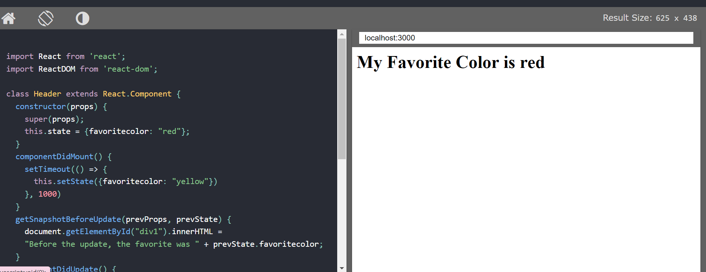
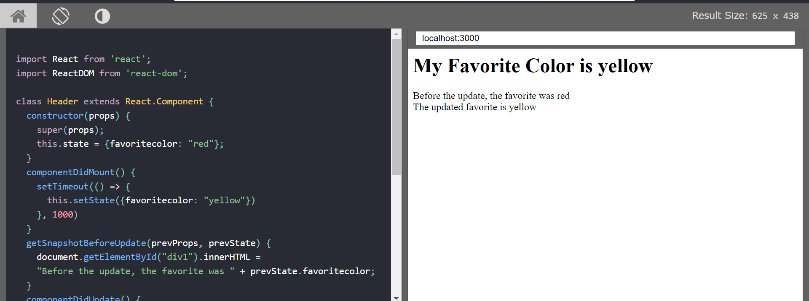
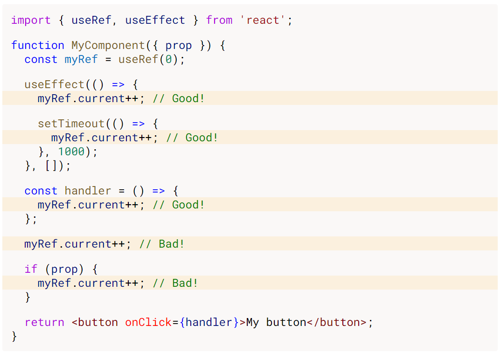

# BÁO CÁO REACTJS

# Table of contents

- [BÁO CÁO REACTJS](#bo-co-reactjs)
- [Table of contents](#table-of-contents)
- [I. Components](#i-components)
  - [1. Class components](#1-class-components)
  - [2. Function Components](#2-function-components)
  - [3. HOC (Higher Order Component)](#3-hoc-higher-order-component)
  - [4. Higher Order Function](#4-higher-order-function)
  - [5. React ref và useRef, forwardRef](#5-react-ref-v-useref-forwardref)
- [II. React Router v6](#ii-react-router-v6)
- [III. Code Splitter](#iii-code-splitter)
  - [1.import()](#1import)
  - [2. React.lazy](#2-reactlazy)

# I. Components

Có 2 loại components trong React là class components và function components.

## 1. Class components

Để tạo một class component:

```Javascript
import React from 'react'

class Title extends React.Component {
    render() {
        return (
            <h2>This is title</h2>
        )
    }
}

```

Đầu tiên, tên của component bắt buộc phải viết hoa chữ cái đầu, những chữ cái tiếp theo nên viết theo dạng camelCase. Class được tạo ra phải `extends` (kế thừa) `React.Component` để có thể truy cập được các `React.Component` function. Class Component thì yêu cầu phải có `render()` method, hàm này sẽ trả về HTML chính là element tạo ra.

Sử dụng class Component như sau:

```Javascript
const html = (
    <div>
        <Title />
        <p>Paragraph</p>
    </div>
)

...
```

#### Constructor của class Components

```Javascript
class Car extends React.Component {
  constructor() {
    super();
    this.state = {color: "red"};
  }
  render() {
    return <h2>I am a {this.state.color} Car!</h2>;
  }
}
```

Trong React, constructor của class Component là nơi khởi tạo các `state` ban đầu của component. Các `state` này nên được lưu trong object là `state` như ví dụ trên.

Hàm super() dùng để thừa hưởng lại mọi thứ trong constructor functions của `React.Component`, qua đó component được tạo ra sẽ access được đến tất cả các functions của `React.Component`.

#### Class Components Props:

Một cách để handling components properties là sử dụng `props`. `props` ở đây được truyền vào components như parameter của function.

```Javascript
class Car extends React.Component {
  render() {
    return <h2>I am a {this.props.color} Car!</h2>;
  }
}

ReactDOM.render(<Car color="red"/>, document.getElementById('root'));


```

Nếu như Components có khai báo `constructor` thì `props` nên được truyền vào `constructor` và `super`

```Javascript
class Car extends React.Component {
  constructor(props) {
    super(props);
  }
  render() {
    return <h2>I am a {this.props.model}!</h2>;
  }
}

ReactDOM.render(<Car model="Mustang"/>, document.getElementById('root'));
```

Sau khi tạo một component thì component cũng giống như các HTML element cho nên ta có thể dùng component này trong component khác.

```Javascript
class Car extends React.Component {
  render() {
    return <h2>I am a Car!</h2>;
  }
}

class Garage extends React.Component {
  render() {
    return (
      <div>
      <h1>Who lives in my Garage?</h1>
      <Car />
      </div>
    );
  }
}

ReactDOM.render(<Garage />, document.getElementById('root'));
```

Như đã nói từ phần ES6, ta phân chia code ra thành các module để dễ quản lý và tái sử dụng. Ta nên viết mỗi component vào một file riêng. Khi nào muốn sử dụng component ở đâu thì chỉ cần import vào mà không cần phải viết đi viết lại.

#### State của Class Components

React class components có sẵn một thuộc tính là `state` object là nơi để lưu trữ các trạng thái của component, khi `state` thay đổi thì component được re-renders. `state` object có thể có nhiều thuộc tính khác nhau.

```Javascript
class Car extends React.Component {
  constructor(props) {
    super(props);
    this.state = {
      brand: "Ford",
      model: "Mustang",
      color: "red",
      year: 1964
    };
  }
  render() {
    return (
      <div>
        <h1>My Car</h1>
      </div>
    );
  }
}
```

Để sử dụng các thuộc tính của state thì ta dùng `this.state.property`.

```Javascript
class Car extends React.Component {
  constructor(props) {
    super(props);
    this.state = {
      brand: "Ford",
      model: "Mustang",
      color: "red",
      year: 1964
    };
  }
  render() {
    return (
      <div>
        <h1>My {this.state.brand}</h1>
        <p>
          It is a {this.state.color}
          {this.state.model}
          from {this.state.year}.
        </p>
      </div>
    );
  }
}
```

Để update `state` của components thì ta sử dụng method `setState`

```Javascript
class Car extends React.Component {
  constructor(props) {
    super(props);
    this.state = {
      brand: "Ford",
      model: "Mustang",
      color: "red",
      year: 1964
    };
  }
  changeColor = () => {
    this.setState({color: "blue"});
  }
  render() {
    return (
      <div>
        <h1>My {this.state.brand}</h1>
        <p>
          It is a {this.state.color}
          {this.state.model}
          from {this.state.year}.
        </p>
        <button
          type="button"
          onClick={this.changeColor}
        >Change color</button>
      </div>
    );
  }
}
```

#### LifeCycle của Class component:

Vòng đời của các component trong react bao gồm:

- Mounting: Bắt đầu xuất hiện trong DOM
- Update: re-render trong DOM
- Unmouting: Gỡ khỏi DOM.

### **Mounting:**

React có 4 built-in methods được gọi theo thứ tự lần lượt như sau khi component được mount vào DOM:

1. `constructor()`
2. `getDerivedStateFromProps()`
3. `render()`
4. `componentDidMount()`

Trong đó `render()` luôn luôn được gọi (bắt buộc), còn các method khác sẽ được gọi nếu ta khai báo trong components.

- `constructor()`:

Đây là hàm được gọi đầu tiên nếu được định nghĩa, dùng để setup các `state` ban đầu của Component, nếu có `props` thì cần truyền `props` vào `contructor` và `super`

```Javascript
class Header extends React.Component {
  constructor(props) {
    super(props);
    this.state = {favoritecolor: "red"};
  }
  render() {
    return (
      <h1>My Favorite Color is {this.state.favoritecolor}</h1>
    );
  }
}

ReactDOM.render(<Header />, document.getElementById('root'));
```

- `getDerivedStateFromProps()`: update các state ban đầu với props của nó, hàm được gọi sau `constructor()` và ngay trước hàm `render()` (ngay trước khi component được render vào DOM). Hàm này nhận vào 2 tham số là `props` và `state` trả về object update `state`, trả về `null` khi không có update gì.

```Javascript
class Header extends React.Component {
  constructor(props) {
    super(props);
    this.state = {favoritecolor: "red"};
  }
  static getDerivedStateFromProps(props, state) {
    return {favoritecolor: props.favcol };
  }
  render() {
    return (
      <h1>My Favorite Color is {this.state.favoritecolor}</h1>
    );
  }
}

ReactDOM.render(<Header favcol="yellow"/>, document.getElementById('root'));
```

Ví dụ trên update `state` của Component bằng `props` được truyền vào trước khi render cho nên khi render ra giá trị `favoritecoloor` sẽ là `yellow`.

- `render()`: Hàm render component hiển thị trên DOM.

- `componentDidMount()`

Hàm gọi ra ngay sau khi component được render vào DOM. Do đó thường sử dụng để thực hiện các các công việc mà cần có mặt component trong DOM hay call api...

```Javascript
class Header extends React.Component {
  constructor(props) {
    super(props);
    this.state = {favoritecolor: "red"};
  }
  componentDidMount() {
    setTimeout(() => {
      this.setState({favoritecolor: "yellow"})
    }, 1000)
  }
  render() {
    return (
      <h1>My Favorite Color is {this.state.favoritecolor}</h1>
    );
  }
}

ReactDOM.render(<Header />, document.getElementById('root'));
```

### **Updating**

Một component sẽ được update khi có `states` hay `props` nào của nó bị thay đổi.

Updating có 5 built-in function được gọi theo thứ tự sau khi component update:

1. `getDerivedStateFromProps()`
2. `shouldComponentUpdate()`
3. `render()`
4. `getSnapshotBeforeUpdate()`
5. `componentDidUpdate()`

Trong đó `render()` luôn luôn được gọi, các hàm còn lại là optional, sẽ được gọi nếu ta khai báo chúng.

- `getDerivedStateFromProps()`

Hàm này được gọi đầu tiên khi có `states` hay `props` của component bị thay đổi, cách hoạt động giống như hàm này ở phần mounting

```Javascript
class Header extends React.Component {
  constructor(props) {
    super(props);
    this.state = {favoritecolor: "red"};
  }
  static getDerivedStateFromProps(props, state) {
    return {favoritecolor: props.favcol };
  }
  changeColor = () => {
    this.setState({favoritecolor: "blue"});
  }
  render() {
    return (
      <div>
      <h1>My Favorite Color is {this.state.favoritecolor}</h1>
      <button type="button" onClick={this.changeColor}>Change color</button>
      </div>
    );
  }
}

ReactDOM.render(<Header favcol="yellow"/>, document.getElementById('root'));
```

Khi nhấn button `Change color` dòng chữ `yellow` giữa nguyên vì hàm `static getDerivedStateFromProps` được gọi đầu tiên khi component update nên nó sẽ thay đổi lại từ `blue` về `yellow`.

- `shouldComponentUpdate()`

Hàm trả về boolean, `true` thì sẽ cho phép update và ngược lại.

```Javascript
class Header extends React.Component {
  constructor(props) {
    super(props);
    this.state = {favoritecolor: "red"};
  }
  shouldComponentUpdate() {
    return false;
  }
  changeColor = () => {
    this.setState({favoritecolor: "blue"});
  }
  render() {
    return (
      <div>
      <h1>My Favorite Color is {this.state.favoritecolor}</h1>
      <button type="button" onClick={this.changeColor}>Change color</button>
      </div>
    );
  }
}

ReactDOM.render(<Header />, document.getElementById('root'));
```

Khi ấn `change color` thì dòng `red` sẽ giữa nguyên vì hàm `shouldComponentUpdate()` trả về `false`, nếu ta sửa lại cho hàm trả về `true` thì `red` sẽ chuyền thành `blue`.

- `render()`

Hàm render lại Component sau khi đã được update.

- `getSnapshotBeforeUpdate()`

Trong hàm này, ta có thể truy cập đến `props` vs `state` của Component trước khi được update tức là kể cả sau khi `state` của Component đã được update r thì ta vẫn xem lại `state` trươc đó của nó được.

Chú ý rằng, phương thức này bắt buộc phải đi kèm với `componenDidUpdate()` nếu không sẽ có lỗi.

Ví dụ :

```Javascript
class Header extends React.Component {
  constructor(props) {
    super(props);
    this.state = {favoritecolor: "red"};
  }
  componentDidMount() {
    setTimeout(() => {
      this.setState({favoritecolor: "yellow"})
    }, 1000)
  }
  getSnapshotBeforeUpdate(prevProps, prevState) {
    document.getElementById("div1").innerHTML =
    "Before the update, the favorite was " + prevState.favoritecolor;
  }
  componentDidUpdate() {
    document.getElementById("div2").innerHTML =
    "The updated favorite is " + this.state.favoritecolor;
  }
  render() {
    return (
      <div>
        <h1>My Favorite Color is {this.state.favoritecolor}</h1>
        <div id="div1"></div>
        <div id="div2"></div>
      </div>
    );
  }
}

ReactDOM.render(<Header />, document.getElementById('root'));
```

Chương trình trên sẽ chạy như sau:

- Component được `mounted` vào DOM, kết quả hiển thị:



Sau khi được `mounted` vào DOM bằng `render`, hàm `componentDidMount` chạy và thực hiện `setTimeout`, sau 1s thì `state` của Component thay đổi.

Hai hàm `getDerivedStateFromProps()`, `shouldComponentUpdate()` không khai báo nên không được gọi nên hàm `render` sẽ được gọi luôn, khi đó t sẽ thấy dòng `My Favorite Color is yellow`. Sau khi đã được updated và render lại thì hàm `getSnapshotBeforeUpdate` được gọi hiển thị thông tin trong `#div1` và cuối cùng thì `componentDidUpdate` được gọi và hiển thị thông tin trong `#div2`



### **Unmounting**

Bỏ Component ra khỏi DOM. Phase này chỉ có duy nhất một hàm được thực hiện ngay trước khi Component được Unmounting khỏi DOM, hàm này thường dùng để remove các event, các hàm không cần thiết sử dụng nếu như không có mặt component trong DOM để tránh bị memory leak.

- `componentWillUnmount()`

**Ví dụ:**

```Javascript
class Container extends React.Component {
  constructor(props) {
    super(props);
    this.state = {show: true};
  }
  delHeader = () => {
    this.setState({show: false});
  }
  render() {
    let myheader;
    if (this.state.show) {
      myheader = <Child />;
    };
    return (
      <div>
      {myheader}
      <button type="button" onClick={this.delHeader}>Delete Header</button>
      </div>
    );
  }
}

class Child extends React.Component {
  componentWillUnmount() {
    alert("The component named Header is about to be unmounted.");
  }
  render() {
    return (
      <h1>Hello World!</h1>
    );
  }
}

ReactDOM.render(<Container />, document.getElementById('root'));
```

Khi ấn nút xóa header thì `componentWillUnmount` sẽ được chạy hiển thị ra alert box, sau đó header mới được gỡ khỏi DOM.

Ngoài ra còn có phase handle error nếu trong quá trình làm việc với DOM của component gây ra lỗi

- `static getDerivedStateFromError()`
- `componentDidCatch()`.

## 2. Function Components

Khai báo một function component:

Cách đặt tên giống như class Component, chữ cái đầu tiên phải viết hoa. Function component đem lại những thuận tiện hơn so với class Component, xử lý state, prop, vòng đời với các hooks.

```Javascript
function Component1() {
  return (
    <h1>This is parahraph</h1>
  );
}

const Component2 = () => {
  return (
    <div>This is div</div>
  )
}
```

Function component sử dụng các hook để handle các state, lifecycle...

Các hook của function component bao gồm:

- [`useState`](https://github.com/sonmh2329/React_Learning#vii-usestate)
- [`useEffect`](https://github.com/sonmh2329/React_Learning#viii-useeffect)
- [`useContext`](https://github.com/sonmh2329/React_Learning#xv-usecontext)
- [`useReducer`](https://github.com/sonmh2329/React_Learning#xiv-usereducer)
- [`useCallback`](https://github.com/sonmh2329/React_Learning#xii-usecallback)
- [`useMemo`](https://github.com/sonmh2329/React_Learning#xiii-usememo)
- [`useRef`](https://github.com/sonmh2329/React_Learning#x-useref)
- [`useImperativeHandle`](#)
- [`useLayoutEffect`](https://github.com/sonmh2329/React_Learning#ix-uselayouteffect)
- [`useDebugValue`]

[HOC `react.memo`](https://github.com/sonmh2329/React_Learning#xi-reactmemo-hoc)

Để mô tả Lifecycle của function components thì ta có hook `useEffect`. Các lifecycle method của class components tương ứng với `useEffect` như sau:

Trước hết ta có syntax:

```Javascript
useEffect(callback, [deps])
```

1. `componentDidMount`: tương ứng với việc sử dụng `useEffect` bình thường (có hoặc không có dependencies) vì `callback` của `useEffect` sẽ luôn được thực hiện ít nhất 1 lần khi component được mounted vào DOM.

2. `componentDidUpdate`: tương ứng với việc sử dụng `useEffect` với dependencies:

    ```Javascript
    useEffect(() => {
      // Inside this callback function we perform our side effects.
    }, [dependency]);
    ```
  
    hoặc

    ```Javascript
    useEffect(() => {
      // Inside this callback function we perform our side effects.
    }, []);
    ```

3. `componentWillUnmount`: tương ứng với việc sử dụng clean up function trong `useEffect` vì clean up function sẽ được gọi trước khi component unmounted khỏi DOM.

    Ví dụ:

    ```Javascript
    useEffect(() => {
      window.addEventListener("mousemove", () => {});
      return () => {
        window.removeEventListener("mousemove", () => {})
      }
    }, []);
    ```

## 3. HOC (Higher Order Component)

Là một Component nhận vào một component khác làm tham số và trả về một component.

Lý do: giúp code có thể tái sử dụng, dễ đọc, dễ nhìn hơn.

**Ví dụ:** Xây dựng HOC giúp làm mờ ảnh khi di chuột vào

```Javascript
const withHoverOpacity = (ImgComponent) => {
  

  return function() {

    const [opacity,setOpacity] = useState(1);

    const onMouseEnter = () => {
      setOpacity(0.5);
    }

    const onMouseLeave = () => {
      setOpacity(1);
    }

    return (
      <div className="hover-wrapper"
        style={{opacity: opacity}}
        onMouseEnter={onMouseEnter}
        oneMouseLeave={onMouseLeave}
      >
        <ImgComponent />
      </div>
    )
  }
}
```

Để có một `ImgComponent` nào đó cần có chức năng mờ đi khi hover vào thì ta làm như sau:

```Javascript
const Image = () => {
  return (
    
  );
}

const HoveredImg = withHoverOpacity(Image);

```

Bây giờ ta đã có component `<HoverdImg />` thỏa mãn yêu cầu.

Xem [ví dụ](https://codesandbox.io/s/prod-butterfly-jcjxr?file=/src/App.js)

## 4. Higher Order Function

**Định nghĩa:** Là function thỏa mãn một trong hai hoặc cả hai điều sau:

- function nhận một hoặc nhiều function khác làm tham số (`callback`)
- function trả về kết quả là một function.

Việc sử dụng Higher Order Function có tác dụng tương tụ như khi sử dụng HOC, giúp code reusable.

### a. Function nhận một hoặc nhiều function khác là tham số

Ví dụ, lấy ra mảng các số thỏa mãn điều kiện nào đó từ mảng cho trước. Vì điều kiện là optional nên ta có ý tưởng tạo một HOF như sau:

```Javascript
const pickNumbers = (arr, conditionFunc) => {
  let result = [];

  for( let i = 0; i< arr.length; i++) {
    if(conditionFunc(arr[i])) {
      result.push(arr[i]);
    }
  }

  return result;
}
```

Bây giờ ví dụ ta muốn lấy ra từ mảng, các số là chẵn

```Javascript
const arr = [1,3,5,2,5,7,8,23,6];

const evenNum = pickNumbers(arr, (number) => {
  return number%2 == 0;
})
```

Hay lấy mảng các số chia hết cho 3 nhỏ hơn 10:

```Javascript
const oddNum = pickNumbers(arr,(number)=> {
  return (number%3==0 && number<10); 
})
```

### b. Function trả về một function

Sử dụng nhiều trong ứng dụng gọi là Currying:

**Định nghĩa:** Currying là kỹ thuật mà cho phép chuyển đổi một function với nhiều tham số
thành những functions liên tiếp có một tham số.

// Ví dụ f(a,b,c) có thể được convert thành g(a)h(b, c) hay g(a)h(b)k(c), thậm chí là đổi thứ tự của các function tương ứng...

Currying sẽ thấy nhiều trong redux.

Xét ví dụ đơn giản:

Hàm kiểm tra độ dài xâu s có vượt quá một số tự nhiên n nào đó

Không dùng Currying

```Javascript
function isLengthOver(s,n) {
  return s.length > n;
}

//Sử dụng
const str = "okhehe";
console.log(isLengthover(str,10));
```

Dùng Currying

```Javascript
function isLengthOver(s) {
  return function(n) {
    return s.length > n;
  }
}

// Sử dụng
const str = "okehihi";
console.log(isLengthOver(str)(10));
```

## 5. React ref và useRef, forwardRef

`useRef` đã được tìm hiểu và có các ví dụ tại phần `useRef` hook của phần function component

Với `useRef` ta có thể tạo ra một giá trị giữ nguyên (persit) giữa các lần render. Thay đổi giá trị tạo bởi `useRef` sẽ không làm component re-render.

Việc thay đổi giá trị `.current` nên được đặt trong `useEffect` hay các hàm handle.Tránh việc xử lý trực tiếp bên ngoài.



**Lưu ý:** Cần hạn chế việc sử dụng `useRef` vì nó làm thay đổi DOM, dễ dẫn đến conflict trong React...

### forwardRef

Ví dụ khi làm việc với web, ta tạo ra một component như sau:

```Javascript
import React from 'react'

const LabelledInput = (props) => {
  const { id, label, value, onChange } = props

  return (
    <div class="labelled--input">
      <label for={id}>{label}</label>
      <input id={id} onChange={onChange} value={value} />
    </div>
  )
}

export default LabelledInput
```

Ta gặp một vấn đề đó là không thể sử dụng `ref` với `LabelledInput` component như những DOM element thông thường. Việc sử dụng ref ở đây sẽ trả về instance của `LabelledInput`, một React component reference chứ không phải là trả về `input` element như ta sử dụng trong ứng dụng focus vào `input` element.

Để giải quyết vấn đề này. Ta dùng `forwardRef` như sau:

```Javascript
import React from 'react'

const LabelledInput = (props, ref) => {
  const { id, label, value, onChange } = props

  return (
    <div class="labelled--input">
      <label for={id}>{label}</label>
      <input id={id} onChange={onChange} value={value} ref={ref}/>
    </div>
  )
}

export default React.forwardRef(LabelledInput)
```

Bọc `LabelledInput` với một HOC là `React.forwardRef`. Bây giờ ta có thể sử dụng custom input component này bình thường như sử dụng với input element.

Xem [ví dụ](https://codesandbox.io/s/input-modal-example-l2wst?from-embed=&file=/src/input-modal.js)

# II. React Router v6

[Link ghi chú](https://github.com/sonmh2329/React_Learning#xvii-react-router-v6)

[Link code sandbox](https://codesandbox.io/s/angry-hoover-ntqpby?file=/src/routes/invoices.js)
# III. Code Splitter

## 1.import()

Thông thường ta sử dụng import như sau:

```Javascript
import {add} from './math';

console.log(add(1,2));
```

Ta có thể dùng như sau:

```Javascript
import('./math').then(math => {
  console.log(math.add(1,2));
})
```

Nếu đang dùng Create react app thì đã được config sẵn, chỉ việc dùng.

## 2. React.lazy

Thay vì phải import hết một loạt các package ta cần trong một lần thì khi dùng `React.lazy` chỉ khi nào ta dùng đến package thì nó mới được gọi.

Before:

```Javascript
import OtherComponent from './OtherComponent';
```

After:

```Javascript
const OtherComponent = React.lazy(()=> import('./OtherComponent'));
```

**Note:** Lazy component nên được bọc bởi React.Suspense như sau:

```Javascript
import React, { Suspense } from 'react';

const OtherComponent = React.lazy(() => import('./OtherComponent'));

function MyComponent() {
  return (
    <div>
      <Suspense fallback={<div>Loading...</div>}>
        <OtherComponent />
      </Suspense>
    </div>
  );
}
```

Việc bọc component với `Suspense` sẽ cung cấp cho ta một `fallback`, `fallback` được gán với một element nào đó và show ra khi lazy component chưa render xong ( ví dụ như spinner xoay...)

Có thể ứng dụng Lazy component trong việc làm route cho web.

```Javascript
import React, { Suspense, lazy } from 'react';
import { BrowserRouter as Router, Routes, Route } from 'react-router-dom';

const Home = lazy(() => import('./routes/Home'));
const About = lazy(() => import('./routes/About'));

const App = () => (
  <Router>
    <Suspense fallback={<div>Loading...</div>}>
      <Routes>
        <Route path="/" element={<Home />} />
        <Route path="/about" element={<About />} />
      </Routes>
    </Suspense>
  </Router>
);
```

Tóm lại, React lazy giúp tăng performance và trải nghiệm người dùng.

**Lưu ý:** `React.lazy` chỉ sử dụng được cho `export default`, vì vậy muốn sử dụng nó với `name export` ta có thể `export default` ra `name export` tại file khác:

Trong `ManyComponents.js`

```Javascript
export const MyComponent = /* ... */;
export const MyUnusedComponent = /* ... */;
```

Trong `MyComponent.js`

```Javascript
export { MyComponent as default } from "./ManyComponents.js";
```

Trong `MyApp.js`

```Javascript
import React, { lazy } from 'react';
const MyComponent = lazy(() => import("./MyComponent.js"));
```